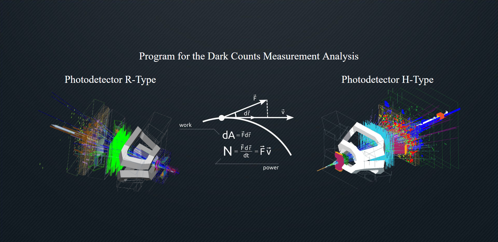
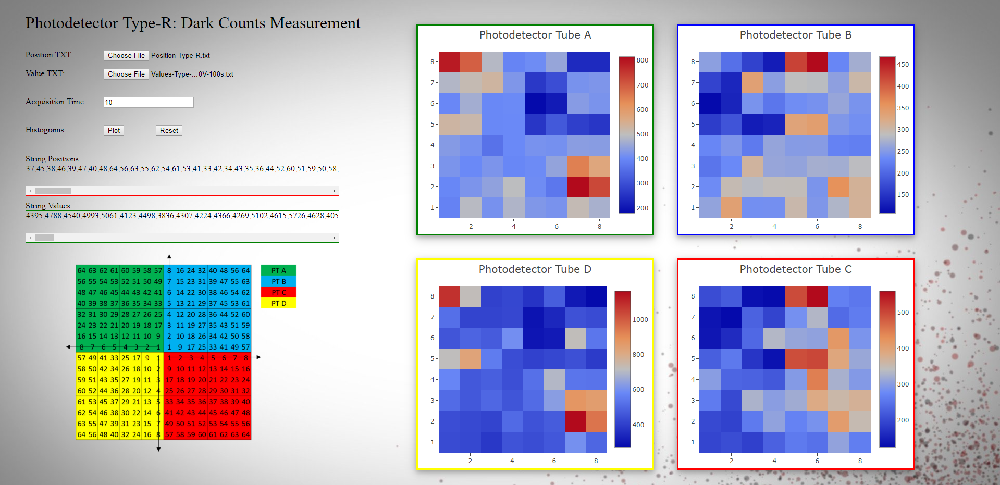
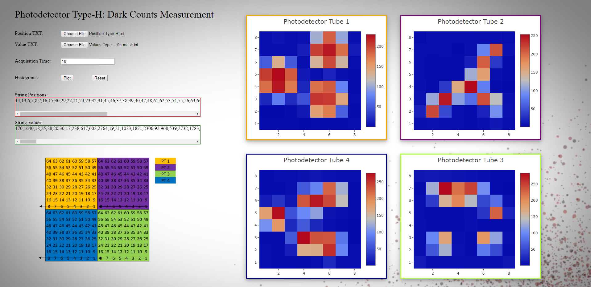

<!-- PROJECT LOGO -->
 

  <h3 align="center">2D Histogram Generator</h3>
  

    Application for generating 2D histograms based on txt files.
     
  

<!-- TABLE OF CONTENTS -->
## Table of Contents

* [About the Project](#about-the-project)
  * [Built With](#built-with)
* [Getting Started](#getting-started)
* [License](#license)
* [Contact](#contact)

<!-- ABOUT THE PROJECT -->
## About The Project

The project was done during my studies. I thought that it would be really nice to create an application which could plot 2d histograms based on the txt files which I obtained during measurements. 

The projecect is about a photodetector. This photodetector has two types, Type-R and Type-H. Depending on the type, the detectors differ a little bit as you can see in the scheme (left-bottom of the page).

The very interesting task for me was to manipulates the arrays so that I could obtain the indexes as shown in the scheme (the biggest struggle was for the R-Type because H-Type was the same in all quarters).

So the program loads the position of each 'pixel' based on the 'Position-Type-H/R.txt' file (which is not in order! it does not go 1, 2, 3... it goes randomly!) and then we load the values for example : "Values-Type-H-200V-100s". Then we have a relation between the first index of position to corresponding value so for example the first index has position 14 and has a value 1113. All 64 positions are assembled to corresponding values, now there was a need to make it in order from 1, 2, 3, ... and so on. Then there was a part with transpositioning so I could obtain proper matrix. Seems hard but it is just playing with indexes!

### Built With
As the project was done when I started learning, it was written just in HTML, CSS and JS. Additionaly I used:
* [Plot.ly](https://plot.ly/javascript/) (library for plotting)
* [Bootstrap](https://getbootstrap.com) (just the menu)

<!-- GETTING STARTED -->
## Getting Started

To run this application, simply download the content and run App.html. You will then see the menu with the options for the two diffrent types of the detector. Choose one.

The program loads two txt files:
1) The first one is always a position. It has to be:
   
  1.1) For the H-Type it is: "Position-Type-H.txt" which can be found in assets/measurements/type-h
   
  1.1) For the R-Type it is: "Position-Type-R.txt" which can be found in assets/measurements/type-r
2) Then we just need to load the actual measurements, which can be also found in the corresponding folders (be careful, R type goes to R type and H type always to H type).
3) Then we can specify the acquisition time in the panel. Every measurement was taken in 100s seconds so if we divide it by 100s we obtain the results in Hz.
4) Then we just need to plot it using the button.
5) If we want to load other set of measurements, we need to reload the page.

<!-- LICENSE -->
## License

Distributed under the MIT License.

<!-- CONTACT -->
## Contact

Name and Surname: Karolina Banasiewicz

E-mail: skkarolinav@gmail.com

GitHub: [Link](https://github.com/Skkarolinav)

LinkedIn: [Link](https://www.linkedin.com/in/karolina-banasiewicz-661a00188/)